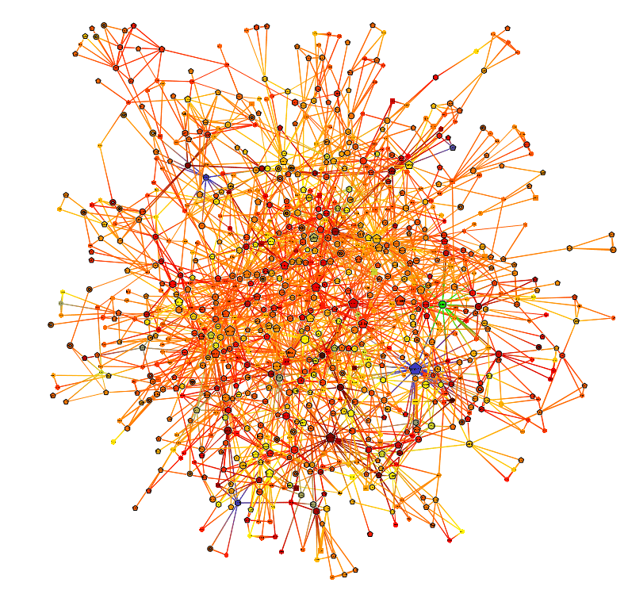

# Polygraph: Customizable Knowledge Graph Pipelines

[](https://www.python.org/)
[](LICENSE)

<p align="center">
  
</p>

<p align="right"><sub><small>Image adapted from <a href="https://www.researchgate.net/figure/Left-The-node-link-diagram-view-renders-glyphs-for-nodes-and-curves-for-edges-The-view_fig3_265011275">Holten &amp; van Wijk (2009)</a>.</small></sub></p>

🌐 Find raw documents → 🧠 Build knowledge graph → 🎯 Train LLM / 🔍 Graph RAG

A research toolkit for building highly customizable Knowledge-Graph generation pipelines. Can either be used to generate knowledge graphs, or to experiment with new KG-generation pipelines with existing benchmarking tests.
This repo provides support for using pre-built KG-generation pipelines and for customizing them by overriding pipeline stages, such as preprocessing stages (chunking, cleaning, deduping, etc.), as well as knowledge-building stages like entity extraction and resolution. The pipelines are implemented as classes that can be easily benchmarked with pre-defined code. The hope is that this will make it easy for people to use the existing pipelines defined in this repo, modify them, and benchmark the changes with minimal effort and code. This repo also contains support for training GNNs to enhance knowledge graphs.

<details>
<summary><strong>📑 Contents</strong></summary>

- [Polygraph: Customizable Knowledge Graph Pipelines](#polygraph-customizable-knowledge-graph-pipelines)
  - [About the Project](#about-the-project)
  - [Getting Started](#getting-started)
    - [Installation](#installation)
    - [End-to-end example](#end-to-end-example)
  - [Documentation](#documentation)
  - [Contributing](#contributing)
  - [License](#license)

</details>

## About the Project


Polygraph began as a hackathon project at the **Vietnam AI Innovation Challenge** where we tackled the problem of creating a data management system for LLM training on vietnamese data. We built a pipeline that scrapes the web for vientamese text data, cleans it, generates a knowledge graph, and fines tunes an LLM on it.

The project won the **$5,000 USD Meta Prize** and has since been refactored into a research project for studying how knowledge graphs

<details>
<summary><strong>More about hackathon...</strong></summary>

During the competition we tackled the goal of data management in LLM training on vietnamese data, where the task was to build a data management system. We chose to approach this problem by building a pipeline that scraped vietnamese websites for text data, and from this generates knowledge graph (insert why knowledge graph). We then wanted to prove that our knowledge graph enriched the training data. We did this by doing fine tuning an LLM (Qwen2.5-1.5B) on vietnamese text data. We compared three variants, (i) the original LLM-model, (ii) the LLM fine tuned on the vietnamese text data, not structured as a knowledge graph (we call this Flat below), and lastly (iii) the LLM fine tuned on the knowledge graph data. It was a small model fine tuned on a small set of text, but we saw that the variant fine tuned on the KG-data performed by far best in later benchmarking. Worth noting is that though these benchmarks show promise, it is far from enough to ensure a trend as the trainnig data was too little as we didnt have time to perform better test duringt the 48 hours.

| Metric | Base Model | KG-Trained (B) | Flat (C) | Improvement |
|---|---|---|---|---|
| **Factual Accuracy** | 2.7% | **18.1%** | 4.2% | 6.8× over base |
| **Multi-hop Accuracy** | 2.7% | **18.1%** | 4.2% | 6.8× over base |
| **Hallucination Rate** | 94% | **0%** | 36% | Eliminated entirely |
| **Consistency Score** | 0.56 | **0.83** | 0.76 | +48% |

> *(B) KG-Trained: fine-tuned on QA pairs from the knowledge graph. (C) Flat: QA pairs from the same documents without KG structuring.*

These early results suggested that KG-structured training data could eliminate hallucinations and deliver 6.8× better factual accuracy, motivating further development into a general research toolkit.

</details>

## Getting Started

<details>
<summary><strong>📁 Architecture</strong></summary>

```
src/
├── polygraph/           # KG library (core)
│   ├── pipelines/       #   swappable variants — subclass Pipeline
│   ├── benchmark_pipeline/  # BenchmarkRunner — runs any pipeline from YAML config
│   ├── models/          #   inference tools — load trained checkpoints
│   ├── preprocess/      #   load / clean / chunk / quality / dedup
│   ├── kg_build/        #   extract / resolve / build
│   ├── kg_eval/         #   metrics / structural
│   ├── kg_export/       #   json / graphml / neo4j / rdf
│   ├── finetune/        #   QA dataset generation
│   └── _shared/         #   config, identity, types
│
└── ml/                  # ML training (parallel to polygraph)
    ├── base_trainer.py  #   BaseTrainer ABC
    ├── training_utils.py #  EarlyStopping, MetricTracker, SaveBest
    ├── entity_resolution/   # binary classifier for merging entities
    │   └── models/
    ├── node_classification/  # GNN for entity type prediction
    │   └── models/
    └── topic_classification/ # GNN for document topic prediction
        └── models/

experiments/
├── kg/                  # pipeline experiments (config.yaml → BenchmarkRunner)
│   └── _template/
└── ML_models/           # training experiments (config.yaml → BaseTrainer)
    └── _template/
```

</details>


### Installation

**Prerequisites:** Python 3.10+ and [uv](https://docs.astral.sh/uv/).

```bash
git clone git@github.com:victor99pekk/polygraph.git
cd polygraph
make install         # syncs all deps + downloads spaCy model
```

Run `make help` to see all available targets.

### End-to-end example

Create a pipeline variant and benchmark it against the baseline in one test:

```python
from polygraph._shared.stage_config import PreprocessConfig
from polygraph.benchmark_pipeline import Benchmark
from polygraph.pipelines import Baseline, PIPELINE_REGISTRY

# 1. Create a new pipeline — subclass Baseline and override a stage
class SmallChunks(Baseline):
    def __init__(self, **kwargs):
        kwargs.setdefault("preprocess", PreprocessConfig(
            chunk_method="sentence", chunk_target_tokens=300))
        super().__init__(**kwargs)

PIPELINE_REGISTRY["small_chunks"] = SmallChunks  # now discoverable by name

# 2. Benchmark both pipelines — pass them into one benchmark test
result = Benchmark.Dedup(dataset="benchmarks/data/dedup_gold.jsonl").run(
    pipelines={"baseline": Baseline(), "small_chunks": SmallChunks()},
)
print(result)                  # aligned per-pipeline table
print("best:", result.best_pipeline())
```

Every benchmark test (`Dedup`, `Chunking`, `Resolution`, `Extraction`, `Quality`,
`RAG`) accepts any number of pipelines and scores them side by side — that's how
you compare variants, so there is no separate `compare()` API. `sentence` chunking
keeps the demo fast — the default is `semantic`. For a whole-pipeline run
(preprocess → build → export), use `BenchmarkRunner` directly. To fetch data for
such a run, pick a sampler and download:

```python
from polygraph.data import Data, DegreeSampler, RandomSampler, SpecificSampler

Data.download("wikipedia", sampler=RandomSampler(count=20))
# SpecificSampler(urls=[...])                      — fetch explicit articles
# DegreeSampler(count=50, target_degree=5.0)       — grow a connected, link-rich set
```

Downloads are automatically enriched with outgoing Wikipedia hyperlinks.

See [docs/tutorial.md](docs/tutorial.md) for more workflows, including uploading a
KG to Neo4j.

## Documentation

| Resource | Description |
|---|---|
| [Tutorial](docs/tutorial.md) | Step-by-step walkthrough — from input data to exported KG |
| [API Reference](docs/api_reference.md) | Complete reference for all public classes and functions |
| [Input Data Format](docs/input_data_format.md) | JSONL schema specification |
| [Contributing Guide](CONTRIBUTING.md) | How to add custom extractors, resolvers, and pipelines |
| [Example Scripts](examples/) | Runnable Python examples for common workflows |


## Contributing

See [CONTRIBUTING.md](CONTRIBUTING.md) for setup instructions, code style, and PR guidelines.

## License

MIT — see [LICENSE](LICENSE) for details.
